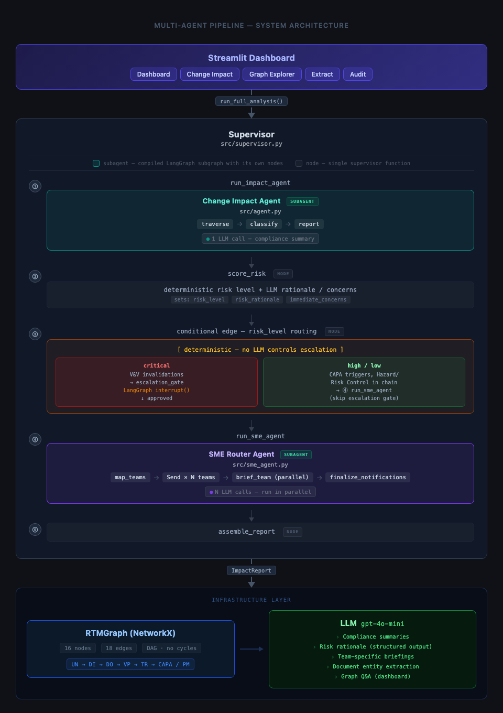

# RTM Knowledge Graph Agent
### hs-cTnI Immunoassay — PMA Change Impact Analysis via Multi-Agent LangGraph

A multi-agent LangGraph system that transforms a static Requirements Traceability Matrix (RTM) into a live dependency graph for an FDA Class III IVD device. When any compliance artifact changes, the agent pipeline traverses the full downstream chain, pauses for human review on critical changes, surfaces every obligation that needs action, and routes team-specific briefings to the right subject matter experts.

---

## What This Builds

FDA PMA device development requires bidirectional traceability across two parallel tracks that merge into a shared design backbone:

```
Design control (the V-model backbone):
  User Needs → Design Inputs → Design Outputs → V&V Protocols → Test Results
                                          (verification closes Output ↔ Input;
                                           validation closes Test Results ↔ User Needs)

Risk management (ISO 14971), running in parallel and feeding into the backbone:
  Hazards → Risk Controls ──▶ Design Inputs / Design Outputs

Quality system (conditional branch off a nonconforming result):
  Test Result (fails spec) → CAPA
```
Most teams manage this in spreadsheets. When a design input changes, someone has to manually trace every downstream obligation, assess the regulatory risk, and figure out who to notify. This project replaces that manual process with a multi-agent LLM pipeline that includes a guardrail: changes that invalidate V&V evidence or trigger PMA supplement review cannot proceed without explicit documented sign-off.

**Six core capabilities:**

1. **RTM Query Bar** — ask plain-English questions about any node, its history, dependencies, or compliance status directly from the dashboard; the LLM answers against the full live graph context
2. **Multi-Agent Change Impact** — select any RTM node, attest the change type (functional / corrective / documentation-only / no change), describe the change, and the supervisor runs: Change Impact Agent (traverse → classify → report) → risk scoring → escalation gate (if critical) → SME Router Agent (team-specific briefings)
3. **Critical-Risk Escalation Gate** — changes that invalidate V&V protocols or trigger PMA supplement review are automatically classified as critical; the pipeline pauses and requires a named reviewer to approve or reject before SME briefings are generated
4. **SME Outreach Flow** — each affected team receives a card with an LLM briefing in their domain vocabulary and an approve button; the human approval gate prevents any status update without documented sign-off
5. **Interactive Graph Explorer** — vis.js hierarchical dependency graph with double-click node detail panels, same-level edge curving to prevent overlap, and root-node subgraph filtering
6. **Audit Readiness Dashboard** — live completeness score, orphan detection, V&V gap report, and PMA supplement flag monitoring

---

## Setup (one API key, that's it)

```bash
# 1. Clone the repo
git clone https://github.com/yourusername/rtm-knowledge-graph-agent
cd rtm-knowledge-graph-agent

# 2. Install dependencies
pip install -r requirements.txt

# 3. Add your OpenAI API key
cp .env.example .env
# Edit .env and set OPENAI_API_KEY=sk-...

# 4. Run
streamlit run app.py
```

The app opens at `http://localhost:8501`. No database, no Docker, no external services.

**Optional:** Override the model with `OPENAI_MODEL=gpt-4o` in `.env` (default: `gpt-4o-mini`).

---

## Architecture



| Layer | Technology | Role |
|-------|-----------|------|
| UI | Streamlit + vis.js | The web dashboard, the interactive graph view, and the human approval screens |
| Supervisor Agent | LangGraph | Runs the agents in order, scores risk, and owns the pause-for-approval gate |
| Change Impact Agent | LangGraph | Walks the dependency graph from the changed item and labels every affected artifact with its required regulatory action |
| SME Router Agent | LangGraph (`Send` API) | Routes affected items to the right teams and writes each team's briefing in parallel |
| Graph Engine | NetworkX | Holds the live dependency graph in memory |
| LLM | OpenAI gpt-4o-mini | Writes the plain-English summaries: compliance notes, risk rationale, team briefings, document extraction, and dashboard Q&A |

---

## Project Structure

```
rtm-knowledge-graph-agent/
├── app.py                    # Streamlit dashboard (entry point)
├── src/
│   ├── supervisor.py         # Top-level LangGraph orchestrator + escalation gate
│   ├── agent.py              # Change Impact sub-agent
│   ├── sme_agent.py          # SME Router sub-agent
│   ├── graph.py              # RTMGraph class, node/edge types, seed data
│   ├── extractor.py          # LLM document extraction module
│   └── regulations.py        # eCFR fetch + cache; injects verbatim CFR text into LLM prompts
├── tests/
│   ├── conftest.py           # pytest: sets CWD to project root, adds src/ to sys.path
│   └── test_all.py           # 150 tests: graph, agent, supervisor, extractor, SME router (all LLM calls mocked)
├── regulations_cache.json    # Auto-generated; verbatim eCFR sections, refreshed every 7 days
├── .streamlit/
│   └── config.toml           # Streamlit theme config
├── requirements.txt
├── .env.example
└── .gitignore
```

Run the test suite (no API key needed — all LLM calls are mocked):

```bash
python3 -m pytest tests/
```

---

## Key Design Decisions

Each decision below leads with *why it matters*, then how it's built.

**The risk rating is decided by code, not by the model.**
The most consequential call in the system — is this change dangerous enough to halt everything? — is never left to the AI. The graph's own structure sets a hard ceiling: a change that invalidates verification evidence is *critical*; one that touches a safety control or quality action is *high*; everything else is *low*. The only thing that can lower that ceiling is the reviewer's own attestation of the change type — selected at submit time, not inferred by a model. A *documentation-only* or *no-change* edit downgrades to *low* even when verification evidence sits downstream; any substantive type leaves the ceiling intact. The risk level is therefore a pure function of two auditable facts — the attested change type and the graph topology — that produces the same answer every time and that an auditor can challenge a named human on. The AI is handed the already-decided level and writes only the plain-English rationale and the immediate actions; it never decides or changes the rating. In a regulated system the worst case must be bounded by facts an auditor can verify, not by a model's opinion. *(Code: `_structural_risk_ceiling` sets the bound; `_risk_level_for_change` applies the attested downgrade; `_assess_risk` calls the LLM for explanation only.)*

**A real stop, not a warning banner.**
When a change is rated critical, the pipeline doesn't flash a warning and keep going — it freezes mid-analysis and refuses to continue until a named reviewer approves or rejects, with their decision and notes recorded on the report. Reject, and the run ends: nothing is notified, nothing changes. This holds because the AI never writes to the graph in the first place — across the entire pipeline it only reads and explains. Only a human clicking *approve* in the UI can change a record, and every change is timestamped and attributed — mirroring the FDA's 21 CFR Part 11 rule that a compliance record can't change without documented human approval. The pause is durable too: the system saves its state to disk, so the halt survives the user refreshing or closing the page. *(Code: LangGraph `interrupt()` + `MemorySaver`; resume requires an explicit `Command(resume=...)`.)*

**Three specialists, one coordinator.**
Tracing impact, scoring risk, and writing team notifications are different jobs with different ways of going wrong, so each is a separate agent that can be tested and swapped independently. Only the supervisor sees the whole pipeline — it runs the agents in order, owns the escalation gate, and assembles the final report. No sub-agent even knows escalation exists, which keeps each one simple and auditable.

**Team briefings written in parallel.**
Each team's briefing is independent of the others, so all of them are generated in a single round-trip rather than one after another — four AI calls in the time of one. *(Code: LangGraph's `Send` API fans the work out; a merge reducer on `team_briefings` lets the parallel results combine without overwriting each other.)*

---

## Seed Dataset

The app loads a representative RTM for a **high-sensitivity cardiac Troponin I (hs-cTnI) immunoassay** — a Class III IVD device under PMA P240052 — covering:

- 2 User Needs (AMI detection sensitivity, emergency TAT)
- 2 Hazards (false negative result — missed AMI; erroneous result — sample interference)
- 2 Design Inputs (LoD ≤ 2.0 pg/mL per CLSI EP17-A2; TAT ≤ 18 min)
- 2 Design Outputs (antibody pair spec v1.4; signal quantification algorithm v2.1)
- 2 V&V Protocols (VP-001: LoD/LoQ verification; VP-002: precision validation)
- 2 Test Results (VP-001: Lot 3 non-conformance at 2.6 pg/mL; VP-002: PASS)
- 2 Risk Controls (ISO 14971 false negative hazard mitigation; CLSI EP07 interference control)
- 1 CAPA (CAPA-018: Lot 3 LoD non-conformance)
**Pre-loaded scenario:** Tightening LoD from ≤ 2.0 pg/mL to ≤ 1.2 pg/mL triggers a critical-risk impact chain: VP-001 re-execution required (V&V invalidation) → escalation gate fires → reviewer must approve before SME notifications go to all four teams.

---

## Regulatory Context

The following regulations are actively queried at startup via the [eCFR public API](https://www.ecfr.gov) (`ecfr.gov/api/versioner/v1`). Verbatim section text is injected into every LLM prompt at runtime and cached locally for 7 days (`regulations_cache.json`).

> **Note — the regulations cache is intentional, not just a speed optimization.** `regulations_cache.json` is the authoritative store of *verbatim* CFR text, and the LLM is explicitly instructed to ground its compliance reasoning in this supplied text rather than its own training knowledge. This keeps every regulatory citation exact, auditable, and version-pinned (the cache records the eCFR retrieval date) and prevents the model from hallucinating or paraphrasing the regulation. The cache is the single source of regulatory truth the model pulls from.

| Section | Source | Scope |
|---------|--------|-------|
| 21 CFR §820.30 | FDA QMSR (21 CFR Part 820) | Design controls — bidirectional traceability requirement |
| 21 CFR §820.40 | FDA QMSR (21 CFR Part 820) | Document controls |
| 21 CFR §820.100 | FDA QMSR (21 CFR Part 820) | Corrective and preventive action (CAPA) |
| 21 CFR §820.180 | FDA QMSR (21 CFR Part 820) | General records requirements |
| 42 CFR §493.1253 | CLIA (42 CFR Part 493) | Establishment and verification of performance specifications (LoD/LoQ) |
| 42 CFR §493.1255 | CLIA (42 CFR Part 493) | Calibration and calibration verification |
