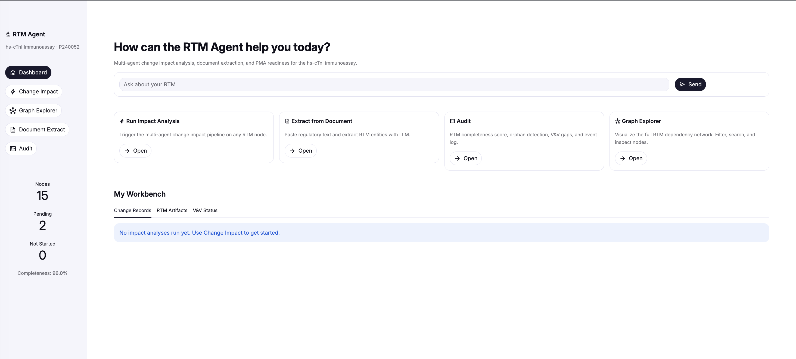
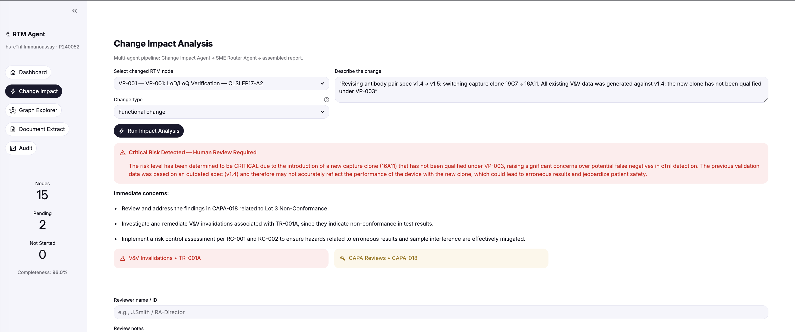
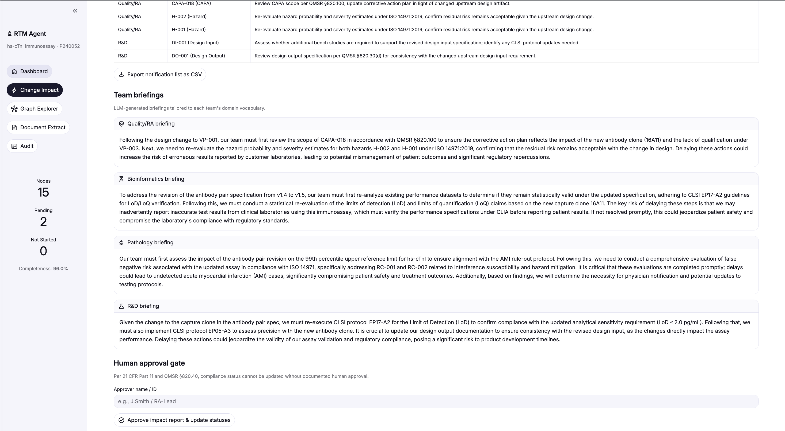
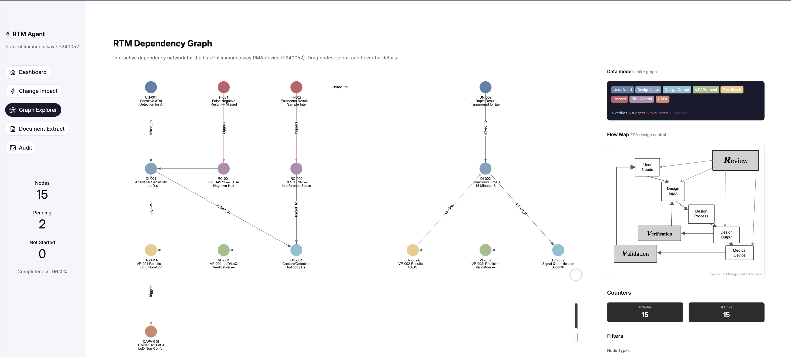
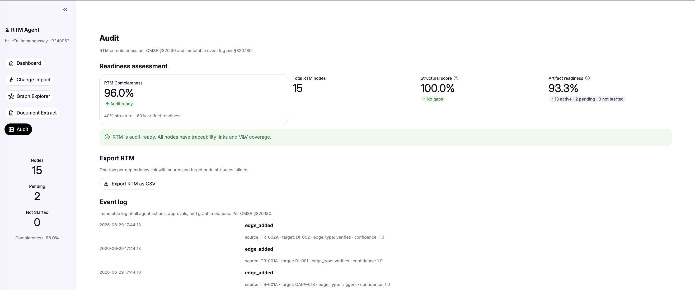
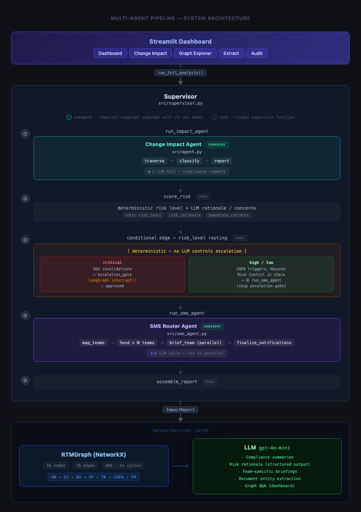

# RTM Knowledge Graph Agent
### Change Impact Analysis via Multi-Agent LangGraph

A multi-agent LangGraph system that transforms a static Requirements Traceability Matrix (RTM) into a live dependency graph for a regulated medical device. When any compliance artifact changes, the agent pipeline traverses the full downstream chain, pauses for human review on critical changes, surfaces every obligation that needs action, and routes team-specific briefings to the right subject matter experts.

---

## What This Builds

FDA device development requires bidirectional traceability:

```
Design control: User Needs → Design Inputs → Design Outputs → V&V Protocols → Test Results
```
Some teams manage this in spreadsheets. When a design input changes, someone has to manually trace every downstream obligation, assess the regulatory risk, and figure out who to notify. This project replaces that manual process with a multi-agent LLM pipeline that includes a guardrail: changes that invalidate V&V evidence cannot proceed without explicit documented sign-off.

**Six core capabilities:**

1. **RTM Query Bar** — ask plain-English questions about any node, its history, dependencies, or compliance status directly from the dashboard; the LLM answers against the full live graph context

2. **Multi-Agent Change Impact** — select any RTM node, attest whether the change is substantive or documentation-only, describe the change, and the supervisor runs: Change Impact Agent (traverse → classify → report) → risk scoring → escalation gate (if critical) → SME Router Agent (team-specific briefings)
3. **Critical-Risk Escalation Gate** — changes that invalidate existing V&V evidence are automatically classified as critical; the pipeline pauses and requires a named reviewer to approve or reject before SME briefings are generated

4. **SME Outreach Flow** — each affected team receives a card with an LLM briefing in their domain vocabulary and an approve button; the human approval gate prevents any status update without documented sign-off

5. **Interactive Graph Explorer** — vis.js hierarchical dependency graph with double-click node detail panels, same-level edge curving to prevent overlap, and root-node subgraph filtering

6. **Audit Readiness Dashboard** — live completeness score, orphan detection, V&V gap report, and FDA inspection readiness by Compliance Program 7382.850 QMS Area


---

## Setup

```bash
# 1. Clone the repo
git clone https://github.com/alex-sajnani/RTM_KnowledgeGraph_Agent.git
cd RTM_KnowledgeGraph_Agent

# 2. Install dependencies
pip install -r requirements.txt

# 3. Add your OpenAI API key
cp .env.example .env
# Edit .env and set OPENAI_API_KEY=sk-...

# 4. Run
streamlit run app.py
```

The app opens at `http://localhost:8501`. No database, no Docker, no external services.

**Optional:** Override the model with `OPENAI_MODEL=gpt-4o` in `.env` (default: `gpt-4o-mini`).

---

## Architecture



| Layer | Technology | Role |
|-------|-----------|------|
| UI | Streamlit + vis.js | The web dashboard, the interactive graph view, and the human approval screens |
| Supervisor Agent | LangGraph | Runs the agents in order, scores risk, and owns the pause-for-approval gate |
| Change Impact Agent | LangGraph | Walks the dependency graph from the changed item and labels every affected artifact with its required regulatory action |
| SME Router Agent | LangGraph (`Send` API) | Routes affected items to the right teams and writes each team's briefing in parallel |
| Graph Engine | NetworkX | Holds the live dependency graph in memory |
| LLM | OpenAI gpt-4o-mini | Writes the plain-English summaries: compliance notes, risk rationale, team briefings, document extraction, and dashboard Q&A |

---

## Project Structure

```
rtm-knowledge-graph-agent/
├── app.py                    # Streamlit dashboard (entry point)
├── src/
│   ├── supervisor.py         # Top-level LangGraph orchestrator + escalation gate
│   ├── agent.py              # Change Impact sub-agent
│   ├── sme_agent.py          # SME Router sub-agent
│   ├── graph.py              # RTMGraph class, node/edge types, seed data
│   ├── extractor.py          # LLM document extraction module
│   ├── regulations.py        # Loads the pinned regulatory snapshot; deterministic prompt grounding
│   ├── regulatory_refresh.py # Source fetchers, live update check, reviewer-approved snapshot update
│   ├── inspection.py         # FDA inspection readiness by CP 7382.850 QMS Area
│   └── claim_check.py        # Claim, citation, and copyright check on every AI output
├── tests/
│   ├── conftest.py           # pytest: sets CWD to project root, adds src/ to sys.path
│   └── test_all.py           # 214 tests: graph, agents, grounding, update check, inspection readiness, claim check (LLM + network mocked)
├── data/
│   ├── regulatory_snapshot.json  # Committed, version-pinned public-domain regulatory text, tagged by authority level
│   ├── standards_registry.json   # Copyrighted standards: metadata only (no text)
│   └── device_definition.json    # Verified device definition: MMI, 21 CFR 862.1215, Class II, 510(k)
├── scripts/
│   └── refresh_regulatory_snapshot.py  # Rebuilds the snapshot from eCFR, Federal Register, FDA
├── .streamlit/
│   └── config.toml           # Streamlit theme config
├── requirements.txt
├── .env.example
└── .gitignore
```

Run the test suite (no API key needed — all LLM calls are mocked):

```bash
python3 -m pytest tests/
```

---

## Key Design Decisions

Each decision below leads with *why it matters*, then how it's built.

**A real stop, not a warning banner.**
When a change is rated critical, the pipeline doesn't flash a warning and keep going — it freezes mid-analysis and refuses to continue until a named reviewer approves or rejects, with their decision and notes recorded on the report. Reject, and the run ends: nothing is notified, nothing changes. This holds because the AI never writes to the graph in the first place — across the entire pipeline it only reads and explains. Only a human clicking *approve* in the UI can change a record, and every change is timestamped and attributed — mirroring the FDA's 21 CFR Part 11 rule that a compliance record can't change without documented human approval. The pause is durable too: the system saves its state to disk, so the halt survives the user refreshing or closing the page. *(Code: LangGraph `interrupt()` + `MemorySaver`; resume requires an explicit `Command(resume=...)`.)*

**Three specialists, one coordinator.**
Tracing impact, scoring risk, and writing team notifications are different jobs with different ways of going wrong, so each is a separate agent that can be tested and swapped independently. Only the supervisor sees the whole pipeline — it runs the agents in order, owns the escalation gate, and assembles the final report. No sub-agent even knows escalation exists, which keeps each one simple and auditable.

**Team briefings written in parallel.**
Each team's briefing is independent of the others, so all of them are generated in a single round-trip rather than one after another — four AI calls in the time of one. *(Code: LangGraph's `Send` API fans the work out; a merge reducer on `team_briefings` lets the parallel results combine without overwriting each other.)*

---

## Seed Dataset

The app loads a representative RTM for a **high-sensitivity cardiac Troponin I (hs-cTnI) immunoassay** — an IVD with product code MMI, classified under 21 CFR 862.1215 as Class II (510(k) pathway), taken from a verified device definition — covering:

- 2 User Needs (AMI detection sensitivity, emergency TAT)
- 2 Hazards (false negative result — missed AMI; erroneous result — sample interference)
- 2 Design Inputs (LoD ≤ 2.0 pg/mL per CLSI EP17-A2; TAT ≤ 18 min)
- 2 Design Outputs (antibody pair spec v1.4; signal quantification algorithm v2.1)
- 2 V&V Protocols (VP-001: LoD/LoQ verification; VP-002: precision validation)
- 2 Test Results (VP-001: Lot 3 non-conformance at 2.6 pg/mL; VP-002: PASS)
- 2 Risk Controls (ISO 14971 false negative hazard mitigation; CLSI EP07 interference control)
- 1 CAPA (CAPA-018: Lot 3 LoD non-conformance)
**Pre-loaded scenario:** Tightening LoD from ≤ 2.0 pg/mL to ≤ 1.2 pg/mL triggers a critical-risk impact chain: VP-001 re-execution required (V&V invalidation) → escalation gate fires → reviewer must approve before SME notifications go to all four teams.

---

## Regulatory Context

Since **February 2, 2026**, FDA's Quality Management System Regulation (QMSR) has replaced the old Quality System regulation. It incorporates **ISO 13485:2016** by reference, so the former design-control, CAPA, document and records sections (§820.30, §820.100, §820.40, §820.180) no longer exist. The app cites the ISO 13485 clause each obligation now lives in, applied through 21 CFR 820.10 (for example, design verification is cited as `ISO 13485 §7.3.6 (QMSR §820.10)`). ISO 13485 is copyrighted, so it is cited by clause number and never quoted.

Every LLM prompt is grounded in **verbatim, version-pinned text** from `data/regulatory_snapshot.json`. The app never fetches regulations at runtime. `scripts/refresh_regulatory_snapshot.py` rebuilds the snapshot: it copies each excerpt verbatim using anchor phrases and fails loudly if a source has changed. It also records each source's URL, version date and SHA-256, so any update shows up as a reviewable git diff. The Audit page lists the snapshot's sources.

Which text a prompt receives is decided **deterministically** by team and by device class, not by similarity search. That keeps every citation reproducible for an auditor.

| Section | Source | Used for |
|---------|--------|----------|
| 21 CFR §820.10 | QMSR (eCFR) | Core QMS requirement; ISO 13485 incorporation; design-control applicability by class (§820.10(c)) |
| 21 CFR §820.35 | QMSR (eCFR) | Control of records |
| 89 FR 7496 excerpts | QMSR final rule preamble | DHF → design and development file (ISO 13485 §7.3.10); risk management; design-control applicability |
| 21 CFR §862.1215 | eCFR | Classification regulation for troponin assays (product code MMI, Class II) |
| 21 CFR §807.81 | eCFR | When a design change needs a new 510(k) |
| FDA 510(k) change guidance excerpts | FDA (2017) | Risk-based assessment, the role of V&V, IVD decision logic (D1/D3), documentation |
| 42 CFR §493.1253 | CLIA (eCFR) | Establishment and verification of performance specifications (LoD/LoQ) |
| 42 CFR §493.1255 | CLIA (eCFR) | Calibration and calibration verification |
| CP 7382.850 excerpts | FDA Compliance Program (2026) | How FDA inspects under the QMSR: QMS Areas, Inspection Model 2 minimum elements, element → ISO 13485 clause tables |
| QMSR page and FAQ excerpts | FDA | QSIT retired on 2026-02-02; IDE devices still need design controls; which records investigators may review |

**Keeping it current.** On the Audit page, **Check for regulatory updates** fetches eCFR, FDA's QMSR page and FAQ, Compliance Program 7382.850 and the 510(k) change guidance, and compares them to the pinned snapshot without changing anything. It reports three things: pinned text that changed (shown as a paragraph-level diff); sources whose content changed even though the pinned passages didn't (links to review for new material); and sources it couldn't check. A named reviewer must click **Apply update**. That rewrites only what changed, records who approved it, logs an audit event, and takes effect immediately in every prompt. Commit `data/regulatory_snapshot.json` afterwards to make it permanent. `python scripts/refresh_regulatory_snapshot.py` rebuilds the whole snapshot from scratch.

**Copyright.** Only public-domain US government text is pinned and sent to the AI. ISO 13485, ISO 14971 and the CLSI standards are held as metadata only (designation, edition, FDA recognition number), and a claim check on every AI output flags quoted standard text, superseded citations, and "FDA requires" claims not backed by a regulation.

**Inspection readiness.** Since February 2, 2026, FDA has inspected device manufacturers under Compliance Program 7382.850, which organizes the QMSR into QMS Areas made of elements tied to ISO 13485 clauses. The Audit page maps the RTM's gaps onto the elements it can evidence, in the Design and Development, Change Control, and Measurement, Analysis, and Improvement areas. Examples: an open verification loop becomes a *Design and Development Verification (Clause 7.3.6)* finding, and an unapproved impact analysis becomes a *Product and Process Changes* finding. Elements the RTM doesn't model are listed as not assessed, never shown as passing.
